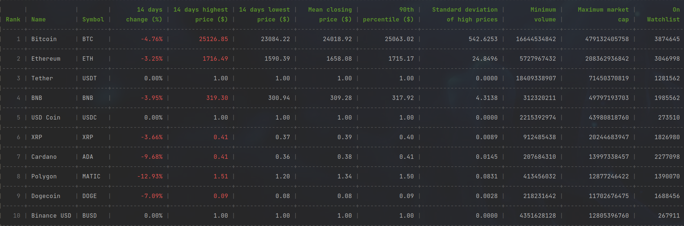

# Coin Scraper

## Installation
1. Clone:
   `git clone https://github.com/Oare/coin-scraper.git`    
    or download the [zip](https://github.com/Oare/coin-scraper/archive/refs/heads/main.zip)  

2. Create Virtual Environment  
    - `pip install virtualenv`
    - `virtualenv .venv`  

3. Activate the virtual environment 
    - `source .venv/bin/activate`  

4. Install dependencies 
    - `pip install -r requirements.txt`  

5. Configuration. Copy config.cfg.example to config.cfg
   - `cp config.cfg.example config.cfg`

## Usage
   - Run `app.py` file from IDE  
   or from command line  
   - `python -m app`

## Analyzer and statistics
### To configure the analyzer mode, in `config.cfg` edit `mode` parameter
    - disabled: Data analysis will be skipped, and no statistical data will be displayed.
    - scrape-analyze: This mode will scrape the data again, perform analysis, and display statistics.
    - analysis: This mode will analyze the existing data and display statistics.

    - you can modify the historical data range by adjusting the `historical_time_range` parameter.

### Here is an example of the output statistics displayed on the console

## Deactivation
   Deactivate the virtual environment
      - `source .venv/bin/deactivate`